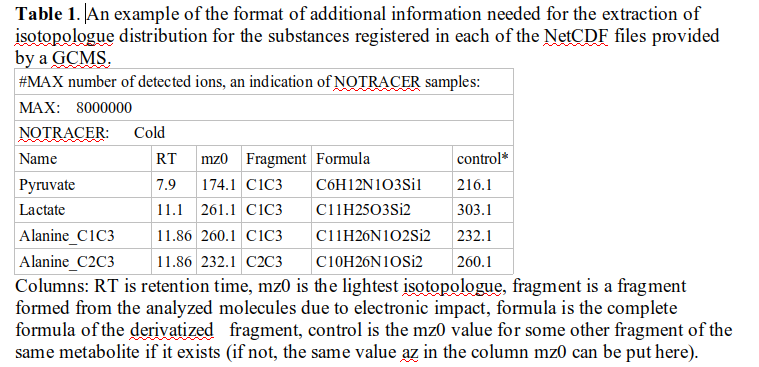
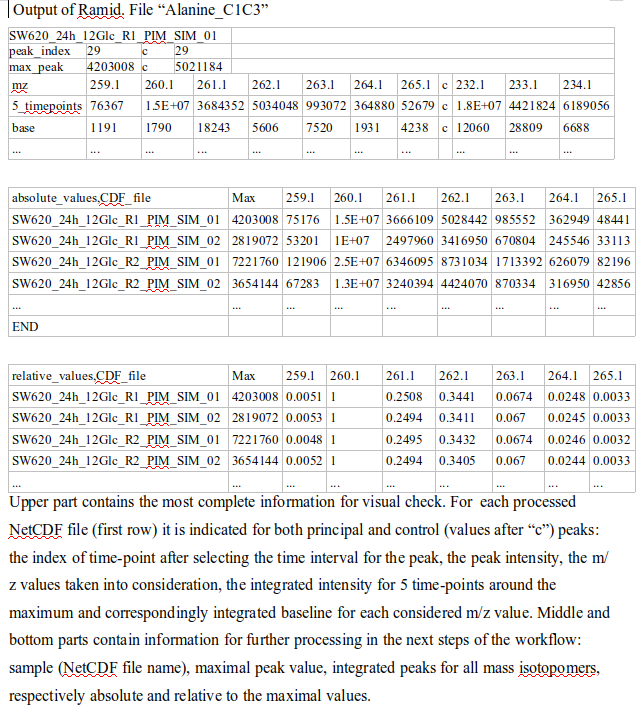

# Ramid
Extract mass isotopomer distribution from NetCDF files saved by mass spectrometers


Version: 1.0

## Short description
R-program designed to extract mass spectra (MS) of 13C-labeled metabolites of interest from raw mass spectrometer recordings.

## Description
Ramid is an “R” program that extracts mass spectra of 13C-labeled metabolites of interest from NetCDF files containing raw MS recordings of time course of their elution from a chromatography column.  The characteristics of the metabolites of interest should be specified in a text file. It evaluates the mass isotopomer distribution (MID) at the moment when peaks of the elution rates are reached, and saves the obtained information in a table, making it ready for the next step of fluxomic analysis: correction for natural isotope occurrence.
Ramid is written in “R”, uses library “ncdf4” (it should be installed before the first use of Ramid). The files “ramid.R” and "lib.R" located in a subdidectory 'R' contain the complete code of Ramid. Its functions are designed to read NetCDF files, extract and visualize the spectra that they contain. 

## Key features
- primary processing raw mass spectrometry data saned in NetCDF files

## Functionality
- Extraction of MID of metabolites of interest specified in a text file. It processed a series of NetCDF files in one run.
- Initiation of workflow of stable isotope tracer data analysis aimed at evaluation of metabolic fluxes

## Approaches
- Using mz and retention time (RT) values to localize the metabolites of interest in the raw MS recordings
    
## Instrument Data Types
- MS

## Data Analysis
- Ramid reads a NetCDF file presented in a directory specified by an input parameter, and then
- separates the time courses of the metabolite elution for the selected m/z values around the RT, both indicated in the description text file, which name is specified by an input parameter;
- corrects baseline for each selected mz;
- determines the actual retention time, which can be different from that indicated a priori in the description file
- integrates the localized peaks thus evaluating the distributions of mass isotopomers of metabolites of interest;
- repeats all the previous steps for the next NetCDF file until all such files are processed;
- saves the extracted MID from all the processed NetCDF files for each metabolite of interest separately in text files readable by MIDcor, a program, which supports the next step of analysis, i.e. correction of the RaMID spectra for natural isotope occurrence.

## Tool Authors
- Vitaly Selivanov (Universitat de Barcelona)

## Container Contributors
- Pablo Moreno(EBI)

## Website
- N/A

## Git Repository
- https://github.com/seliv55/ramidcor

## Installation

- Ramid itself does not require installation, just clone or download this directory. However, the R library 'ncdf4' that supports reading NetCDF files should be installed. Also, a library containing Ramid can be created from the code available here, although this is an option. Another option is to read source files directly in each session (see below). To make the library 'ramidcor' the library 'devtools' should be installed. The library 'ramidcor' would contain, in addition to Ramid, also Midcor for the correction of the Ramid extracted spectra and Isoform for formatting the corrected data to prepare them for simulation with Isodyn. To install 'ncdf4', 'devtools' and make the library 'ramidcor' use the following commands:

   
```
 cd <ramidcor>
 
 sudo R
 
 install.packages(‘ncdf4’)

 install.packages(‘devtools’)

 library(devtools)
 
 build() 
 
 install() 
 ```
## Usage Instructions

- The programs Ramid, Midcor, Isoform support three subsequent steps of preparation of raw MS data for the fluxomic analysis. 
### 1. Extraction of raw mass spectra from NetCDF files saved by a mass spectrometer, containing recordings in selected intervals of m/z using Ramid:

  
```
 cd <path_to_ramidcor>
 
 R 
 
 # if the library 'ramidcor' was not created, then read the source directly:
 
 source("R/ramidwin.R") 
 
 source("R/lib.R")
 
 # if the library 'ramidcor' was created, load it:
 
 library(ramidcor)
 
 library(ncdf4)
 
 # run Ramid:
 
  ramid(infile='<path_to_description>',cdfdir='<path_to_NetCDFs/>',fiout='out.csv',md='scan')
```
- here the first parameters is the path to a text file containing a short description of the metabolites of interest exemplified in the screenshot below; the second parameter is the path to a directory containing the .CDF files with raw mass spectrometer data; 


the third parameter is a path to the output file where the (MID) of all the metabolites of interests are grouped in the format provisional for the database Metabolights; the third parameter is the mode of the mass spectrometer recording, the default value is 'scan'. However, in addition to the default output 'out.csv' Ramid produces a series of files in the directory '../files/\<NetCDFs/\>', where the data for each metabolite extracted from all the available NetCDF files are saved in separate text files under the names of the corresponding metabolite. An example of such an output is shown here


### 2. After completing the extraction of the mass spectra of interest Midcor can read the files generated by Ramid for each metabolite of interest and correct them for natural isotope occurrence taking the information of the chemical composition of the analyzed derivated metabolite molecule from the same description text file that is used as an input for Ramid and exemplified in the screenshot above (column Formula). The following commands should be used to execute Midcor:
 
```
cd <path_to_ramidcor>
 
 R 
 
 # if the library 'ramidcor' was not created, then read the source directly:
 
 source("R/midcor.R") 
 
 source("R/lib.R")
 
 # if the library 'ramidcor' was created, load it:
 
 library(ramidcor)
 
 # run Midcor:
 
  midcor(infile='<path_to_description>',cdfdir='<path_to_NetCDFs/>',fiout='out.csv',md='scan')
```
 rumidcor(infile="sw620",dadir="files/SW620/")
```


3. Then the corrected data can be checked and wrong data edited/eliminated manually. The tool Stadyn reads the checked files performs simple statistical analysis for repeated measurements and prepares the data for simulation.
```
 isoform(isofi='toIsodyn',dor="SW620/",marca=3)
```
## The format of input data description

- The input data description file (here "sw620") contains the additional information prepared by the data provider that is necessary for the analysis and for the output table to write in the format accepted as exchangeable with the Metabolights database. It contains the following columns: 
(i) names of metabolites of interest, which spectra should be extracted from the provided CDF files; 
(ii) retention time (RT); 
(iii) m/z value of the lightest isotopomer (mz0) corresponding to the resolved derivatized fragment of metabolite of interest; 
(iv) position of the resolved carbon fragment in the parent molecule; 
(v) chemical formula of the derivatized compound containing the given fragment; 
(vi) m/z value of the lightest isotopomer corresponding to another fragment of the same metabolite (control).

## The names of CDF files provided

- The input file (here "sw620") provides the general informarion used by the program. Moreover, the names of CDF files should contain a specific information referred to each separate measurement. Here is an example of filename: "SW620_6h_12Glc_R1_PIM_SIM_01.CDF". SW620 is the type of analyzed cells 6h is the time of incubation 12Glc indicates the artificially labeled substrate applied. R1 is a number of biological replicate 01 is a number of ingection to MS machine from the same biological replicate

Based on this information and that extracted from the CDF files presented in the working directory siMID evaluates the mass spectra of the metabolites listed in "metdata", and saves it in tables accepted as exchangeable with Metabolights database.

## An example provided

- Run the provided example using the command:

```
  metan(infile="sw620",cdfdir="SW620/",fiout="out.csv")
```


